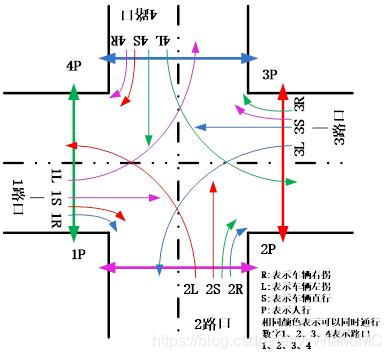

# Traffic-light-simulation
Six way Traffic light system using 8051 Microcontroller

6-lane roads with traffic lights.

## Tools
### Keil4
using keil4 to complie code and bulid the hex file
### Protues7
Open the DSN file and Simulate the crossroad

## Circuit.DSN

Download DSN file from Release page

## BOM
|name|count|
|--|--
|AT89C51|1
|RESPACK-8|1|
|74HC573|8|
|NOT|8|
|AND_3|4|
|TRAFFIC LIGHTS|20|
|7SEG-MPX4-CC|4|